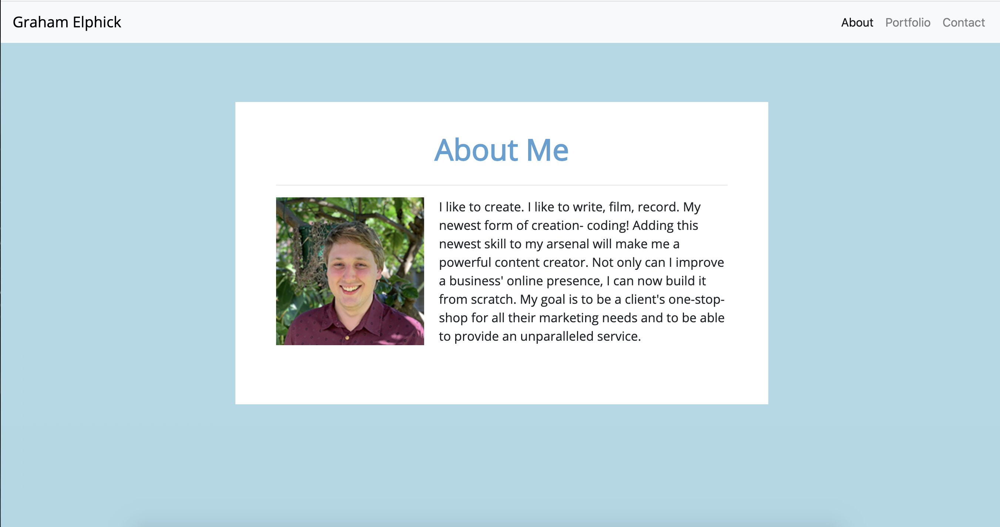
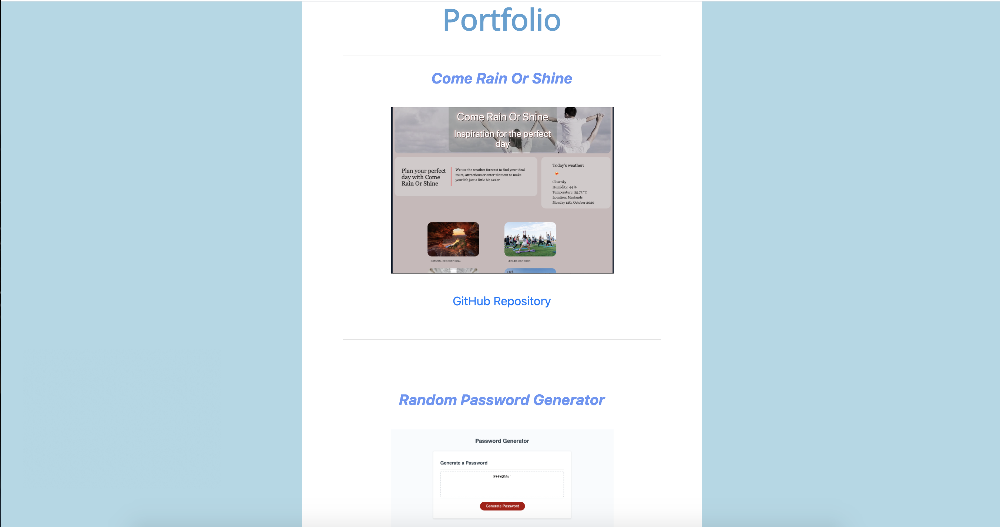
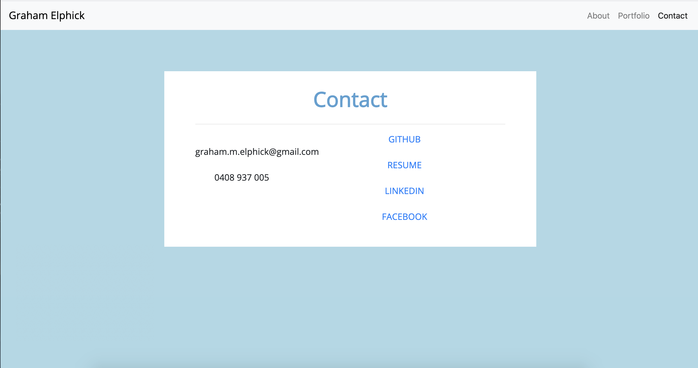

# updated-portfolio

This portfolio site provides users with a quick bio about the Graham Elphick, some samples of his work as well as contact information.

Link to deployed application:

https://grahamelphick.github.io/updated-portfolio/

The user can navigate to the About, Portfolio and Contact page using the navbar at the top of each page. The About page can also be accessed at any time by clicking on "Graham Elphick" in the top left corner.

The Portfolio page presents the user with three samples of Graham Elphick's work. Each sample includes the name of the project, a screenshot of the deployed application (both of which will, upon clicking, link to the deployed application) and a link to the GitHub repository.

The Contact page contains Graham Elphick's email address and phone number as well as links to his GitHub profile, resume (PDF), LinkedIn and Facebook.